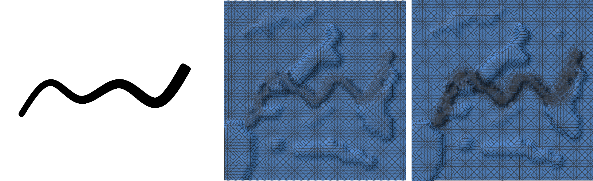
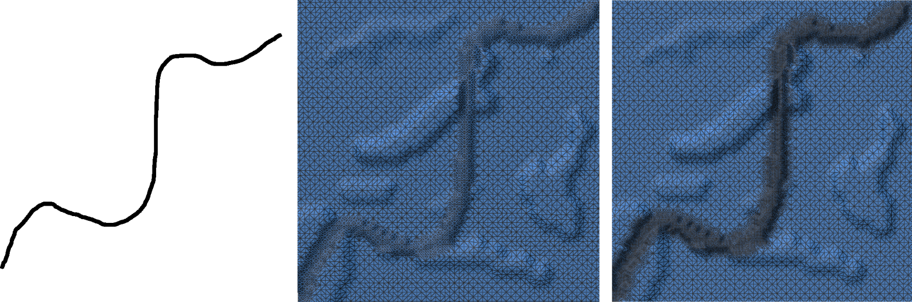

# Adaptive road

Add sketch to input mesh.

# Requirements
- [CGAL](https://www.cgal.org/)
- [OpenCV](https://opencv.org/) *for python*
- [Polyscope](https://polyscope.run/) *for python*

# Usage:
`./build/adaptive_road <mesh> <sketch> <level> <vis>`

mesh: name of the input OFF file without the OFF format. i.e., blender_terrain
sketch: name of the input .png sketch file without the formart, i.e., shaky
level: levels of subdivision to use, i.e., 2
vis: 1 to show visualization at the end, 0 to disable.

*Note: Some additional variabels in "insertion/main.py" can be tweaked, to achieve better resutls on specific road sketches.*

# Screenshots
Left: input sketch, middle: one level of subdivision, right: two levels of subdivision.
## B-Spline curve

## Freehand sketch

## TODO
- use DEM and osm gps data (should be easy).
- add user interface for drawing sketch.
- convert python code to cpp.

## Credits
- [CGAL](https://www.cgal.org/)
- [OpenCV](https://opencv.org/)
- [Polyscope](https://polyscope.run/)
- [Adaptive Subdivision](https://github.com/sywe1/adaptive-subdivision) *the template for adaptive subdivision is adopted from this repository.*